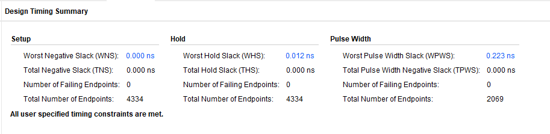

# 64-bit Pipelined Multiplier for Maximum Frequency

A high-frequency pipelined 64-bit multiplier targeting Xilinx Kria KV260 (Zynq® UltraScale+™ MPSoC).

## Overview
- Implements a multi-stage pipelined 64x64 bit multiplication
- Optimized for maximum clock frequency on KV260
- Decomposes operation into smaller multiplications with registered stages
- Trading increased latency for higher throughput

## Architecture
- Input: Two 64-bit operands (A, B)
- Output: 128-bit result
- Pipeline depth: 11 stages
- Uses DSP blocks for 32x32 partial products

## Results
- Maximum achieved frequency: 507 MHz
- Timing analysis: 1.971 ns
